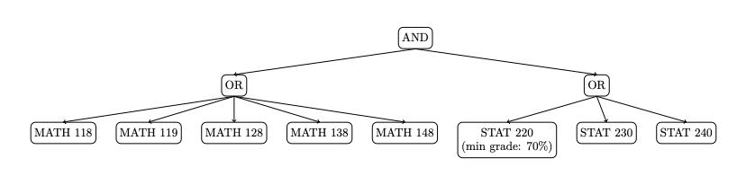

# Database Seed Script for Course Prerequisites System

This script populates the database with sample course data and prerequisite relationships
using a tree-based structure. It demonstrates the following:

**⚠️ Warning**: This script will clear all existing data in the database before inserting new sample data.

## Features

1. **Course Data**: Inserts STAT 231 and its prerequisite courses (MATH 118-148, STAT 220, 230, 240)
   along with antirequisite courses (STAT 221, 241)

2. **Prerequisite Tree Structure**: Creates a hierarchical tree representing complex prerequisite logic:

   - Root: AND relationship
   - Group 1: MATH courses (OR relationship) - any one of MATH 118, 119, 128, 138, 148
   - Group 2: STAT courses (OR relationship) - any one of STAT 220 (with 70% min grade), 230, or 240

3. **Program Restrictions**: Adds enrollment restrictions for STAT 231 (Honours Math or Math/Phys students)

## Tree Structure

The tree structure allows for complex prerequisite logic like:
`"(MATH 118 OR MATH 119 OR MATH 128 OR MATH 138 OR MATH 148) AND (STAT 220 with grade >= 70% OR STAT 230 OR STAT 240)"`

### Visual Tree Structure:



**Logic**: Student must complete (any MATH course) AND (any STAT course with grade requirements)

## Usage

```bash
pnpm seed
```
